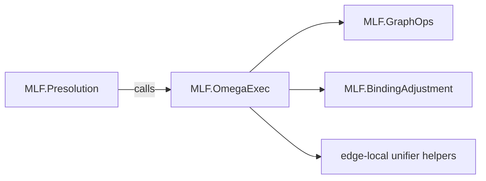

# Design Document

## Overview
This spec closes remaining “paper-faithfulness” gaps after `.kiro/specs/paper_general_raise_plan`:

1) **Docs parity:** remove stale documentation that contradicts the current χe/Ω/Φ behavior.
2) **Node kinds:** implement paper §3.1’s distinction between `Restricted` and `Locked` and use it for ω legality + Ω normalization checks.
3) **No silent fallbacks:** tighten binding-edge harmonization so impossible Raises are errors (not “best effort”).
4) **Central ω execution:** factor χe ω execution (Graft/Merge/Weaken) out of `MLF.Presolution` into a shared module.

The goal is to improve paper alignment without changing the solver’s external API, and with minimal behavioral changes beyond removing silent/incorrect fallbacks.

Scope note: retiring the legacy `GNodeId`/`cGNodes`/`tnVarLevel` scope model is tracked as a separate large spec: `.kiro/specs/scope-model-retirement`.

## Architecture
Today, χe ω execution is split:
- `Raise` is executed via binding-edge harmonization (`BindingAdjustment` + `GraphOps.applyRaiseStep`).
- `Weaken` is executed via `GraphOps.applyWeaken`.
- `Graft`/`Merge` are executed via presolution-local code (`setVarBound`, `unifyAcyclicEdgeNoMerge`, etc.).

This spec introduces a shared “ω executor” for χe:



Key intent: ω execution is performed once (in `MLF.OmegaExec`), while `MLF.Presolution` retains responsibility for:
- choosing expansions,
- building the `EdgeWitness` and `EdgeTrace`,
- orchestrating phase-2 unification that may emit additional merge-like ops.

## Components and Interfaces

### 1) Node-kind classification (paper §3.1)
Add a shared “node kind” classifier derived purely from binding edges:

```hs
data NodeKind
  = NodeRoot
  | NodeInstantiable
  | NodeRestricted
  | NodeLocked

nodeKind :: Constraint -> NodeId -> Either BindingError NodeKind

-- | True iff @nid@ is strictly under some rigid binding edge.
isUnderRigidBinder :: Constraint -> NodeId -> Either BindingError Bool
```

Definitions (from `papers/xmlf.txt` §3.1):
- `NodeInstantiable`: binding path is flexible up to the root.
- `NodeRestricted`: node’s own binding edge is rigid.
- `NodeLocked`: node’s own edge is flexible, but some ancestor edge is rigid.
- `NodeRoot`: no binding parent.

`isUnderRigidBinder` is used for Ω normalization (“no operations under a rigidly bound node”):
- For a restricted node `n`, `isUnderRigidBinder n == False`.
- For any descendant of `n`, `isUnderRigidBinder == True` because `n`’s rigid edge becomes an ancestor edge.

### 2) Binding-edge harmonization: fail-fast semantics
The current binding-edge harmonization (`MLF.BindingAdjustment`) still contains two non-paper behaviors:
- `findBindingLCA` falls back when there is no common ancestor.
- `raiseToParentWithCount` / `raiseToRoot` silently stop when a Raise would be required but the node is not instantiable.

We tighten these to match paper intent:
- if a Raise is required, but the node is not instantiable, harmonization fails with `BindingError` (propagated as a phase error).
- if LCA cannot be computed, fail with `InvalidBindingTree` (or a more specific error).

This makes Ω traces trustworthy: a recorded `OpRaise` always corresponds to an executed Raise step.

Additional invariant (pragmatic, UF-aware)
----------------------------------------
During presolution, nodes are merged via a union-find, and binding-tree queries are interpreted on
the induced quotient graph (`Binding.checkBindingTreeUnder`, `interiorOfUnder`).

To avoid “forest LCA” artifacts where two binders become equal via UF but `cBindParents` still
mentions their pre-merge aliases, presolution canonicalizes `cBindParents` after each UF merge
(dropping self-edges and merging duplicates). This keeps `BindingAdjustment`’s raw `bindingLCA`
behavior correct on UF representatives and ensures ω operations like `Weaken` always target a node
that still has a binding edge to flip.

### 3) Central ω execution (`MLF.OmegaExec`)
Create `src/MLF/OmegaExec.hs` to host χe ω execution logic currently in `MLF.Presolution`:

```hs
executeOmegaBaseOpsPre
  :: CopyMap
  -> [InstanceOp]
  -> EdgeUnifyM ()

executeOmegaBaseOpsPost
  :: CopyMap
  -> [InstanceOp]
  -> EdgeUnifyM ()
```

Semantics (unchanged, just centralized):
- `OpGraft σ bv`: set the instance bound for the binder-meta of `bv`.
- `OpMerge bv bound`: unify binder-meta classes inside χe (without emitting opposing merge ops) and eliminate the binder-meta.
- `OpWeaken bv`: execute paper weaken on binder-meta’s binding edge (flex → rigid), tolerate idempotent weaken as a no-op, and record binder elimination for witness bookkeeping.

Implementation notes:
- The executor lives in presolution’s monad (`EdgeUnifyM`) because it needs access to:
  - `copyMap`,
  - edge-local union-find operations,
  - binder elimination bookkeeping (`recordEliminate`, `dropVarBind`, etc.).
- `MLF.GraphOps` remains pure for binding-tree rewrites only.

## Data Models
New public types:
- `NodeKind` (in `MLF.Binding` or a dedicated small module like `MLF.NodeKind`).

No changes to `Constraint` are required for this spec.

## Error Handling
- Node-kind queries return `BindingError` (wrapped as `PresolutionError` / `ElabError` at call sites).
- Binding-edge harmonization returns `Either BindingError …` and is propagated (no silent fallbacks).
- The ω executor uses existing presolution error constructors (e.g. `BindingTreeError`, `InternalError`) and should not introduce partial failures.

## Testing Strategy
Prefer small regressions + targeted properties:

1) **NodeKind regressions**
   - hand-built binding-parent maps:
     - restricted vs locked distinction,
     - `isUnderRigidBinder` behavior on restricted nodes vs descendants.

2) **Harmonization fail-fast regressions**
   - a binding tree where raising is required but the node is locked ⇒ harmonization returns `OperationOnLockedNode` (or a dedicated error).
   - a malformed binding tree with no LCA ⇒ harmonization errors.

3) **ω executor refactor safety**
   - run existing presolution tests around `OpWeaken`/`OpRaise` recording + replay.
   - add a small regression asserting base ω ops are still executed (e.g. weaken flip persists).
