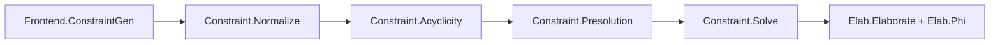

# Design Document

## Overview
This design aligns the current pipeline with `papers/these-finale-english.txt` as the source
of truth. The implementation already mirrors the thesis phases and data model; this spec
captures module boundaries, mapping of paper constructs to Haskell types, and the two
identified alignment gaps (non-expansion instantiation semantics and interior Raise
emission) that need follow-up.

## Architecture
Pipeline-level structure follows the thesis constraint-solving phases:

Phase entry points and public wiring:
- Phase 1: `MLF.Frontend.ConstraintGen.generateConstraints`
- Phase 2: `MLF.Constraint.Normalize.normalize`
- Phase 3: `MLF.Constraint.Acyclicity.checkAcyclicity`
- Phase 4: `MLF.Constraint.Presolution.computePresolution`
- Phase 5: `MLF.Constraint.Solve.solveUnify`
- Phase 6: `MLF.Elab.Run.runPipelineElab` (elaboration + generalization)

## Components and Interfaces
- `MLF.Frontend.Syntax`: eMLF surface AST for variables, lambda, application, let, and
  annotations. This is the input to Phase 1.
- `MLF.Frontend.ConstraintGen` and `MLF.Frontend.ConstraintGen.Translate`: builds the
  constraint graph; inserts instantiation edges at applications; introduces gen nodes and
  expansion wrappers for let bindings; implements the alternative let scoping used for
  translatable presolutions.
- `MLF.Constraint.Types`: core graph types (term-DAG nodes, binding tree edges, instantiation
  edges, unification edges, expansions, witnesses).
- `MLF.Binding.Tree`: binding tree invariants and operations (parent lookup, LCA, interior,
  ordering).
- `MLF.Constraint.Normalize`: local rewrites (grafting, merging) to reach a locally solved
  form.
- `MLF.Constraint.Acyclicity`: dependency graph and ordering for instantiation edges.
- `MLF.Constraint.Presolution`: minimal expansion decisions, graph rewriting, and witness
  recording (with edge traces).
- `MLF.Constraint.Solve`: final unification and constraint canonicalization.
- `MLF.Elab.Types`, `MLF.Elab.Phi`, `MLF.Elab.Elaborate`: xMLF types/terms, translation of
  witnesses to instantiation computations, and term elaboration.
- `MLF.Elab.TypeCheck`: xMLF typing and instantiation checking.

## Data Models
Mapping of key paper constructs to Haskell types (with notable differences):
- Constraint chi: `Constraint` (term-DAG `cNodes`, binding tree `cBindParents`,
  instantiation edges `cInstEdges`, unification edges `cUnifyEdges`).
- Gen nodes and schemes: `GenNode` plus `Constraint.cGenNodes`.
- Binding flags: `BindFlag` with flexible/rigid edges.
- Expansion variables and recipes: `TyExp` nodes plus `Expansion` recipes.
- Witnesses: `InstanceWitness` for omega ops and `EdgeWitness` for per-edge metadata.
  Note: the implementation stores interleaved steps (`InstanceStep` includes `StepIntro`)
  to represent quantifier introduction alongside omega operations.
- xMLF types/terms: `ElabType`, `ElabTerm`, and `Instantiation` for explicit instantiation
  computations; includes `TBase` for base types as an implementation extension.

Known design deltas to the thesis:
- `TyExp` nodes are used at occurrence sites to represent expansion variables instead of
  constructing a separate expansion graph per instantiation edge; presolution later
  materializes and removes them. This is a representation choice that preserves semantics
  but differs from the presentation.
- Witness steps store `StepIntro` (quantifier introduction) interleaved with omega
  operations; the thesis treats O outside omega, so this is an encoding convenience.
- Interior Raise ops are defined but not fully emitted yet (see requirements 3.4, 5.3).
- Instantiation edges with non-expansion LHS are currently simplified to equality in
  presolution (see requirement 3.3).

## Error Handling
Errors are surfaced at phase boundaries with phase-specific types:
- Phase 1: `ConstraintError` for invalid source expressions.
- Phase 3: `CycleError` for cyclic instantiation dependencies.
- Phase 4: `PresolutionError` for binding-tree violations or non-translatable presolutions.
- Phase 5: `SolveError` for constructor clashes, occurs-check failures, or residual TyExp.
- Phase 6: `ElabError` for missing nodes, invalid witnesses, or binding-tree issues.
- xMLF checks: `TypeCheckError` for explicit term/type mismatches.

Normalization and presolution keep some errors as residual edges to defer reporting to
later phases with richer context.

## Testing Strategy
- Unit tests for constraint generation (application, let, annotated let) should confirm the
  expected instantiation edges and binding structure.
- Presolution tests should assert expansion decisions and witness normalization behavior,
  including edge traces and omega operations.
- Elaboration tests should validate that `phiFromEdgeWitness` produces instantiations that
  transform source types into target types.
- End-to-end pipeline tests should use `cabal test` with representative examples from
  Sections 9-15 of the thesis.
