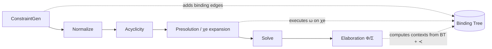

# Design Document

## Overview
We add a paper-faithful binding tree to the constraint graph and use it as the source of truth for scope and “raising”. This enables `Raise(n)` for arbitrary instantiable nodes (not only `TyVar` rank adjustment) and makes Ω a sequence of *executable* graph transformations on χe, as described in `papers/xmlf.txt` (§3.1–§3.4, Figure 10).

The design is intentionally staged:
1) introduce binding edges alongside the existing `GNode`/`tnVarLevel` model,
2) implement `Raise`/`Weaken` as binding-tree rewrites (slide / flex→rigid),
3) upgrade expansion χe to copy binding edges and compute exact interior,
4) emit `OpRaise` for arbitrary interior nodes in presolution,
5) extend Φ to translate those raises using real instantiation contexts.

## Architecture
High-level flow (existing pipeline, augmented with binding edges):



Key modules to add:
  - `MLF.Binding`: binding-tree data model, traversal, invariants, “upper” checks.
  - `MLF.GraphOps`: pure implementations of ω operations on χ/χe (Raise/Weaken; later Graft/Merge if desired).
  - `MLF.BindingAdjustment`: “harmonize” logic for unification, generalized from `TyVar`-only rank adjustment to binding-tree raising, returning a trace of Raise steps.

Existing modules updated:
  - `MLF.Types` (`Constraint` gains binding-edge metadata, plus error types)
  - `MLF.ConstraintGen` (populate binding edges when constructing constraints)
  - `MLF.Presolution` (copy binding edges during expansion; compute exact `I(r)`; record `OpRaise` for arbitrary interior nodes)
  - `MLF.Normalize` / `MLF.Solve` (use binding-edge harmonization before unions that would violate binding invariants)
  - `MLF.Elab` (Φ: compute contexts for non-spine `OpRaise` using binding edges + ≺)

## Components and Interfaces

### Binding tree (new: `MLF.Binding`)
Core types (Haskell-level sketch):

```hs
data BindFlag = BindFlex | BindRigid

type BindParents = IntMap (NodeId, BindFlag) -- child -> (parent, flag)

lookupBindParent :: Constraint -> NodeId -> Maybe (NodeId, BindFlag)
setBindParent :: NodeId -> (NodeId, BindFlag) -> Constraint -> Constraint

bindingRoots :: Constraint -> [NodeId]
bindingPathToRoot :: Constraint -> NodeId -> Either BindingError [NodeId]
bindingLCA :: Constraint -> NodeId -> NodeId -> Either BindingError NodeId

isUpper :: Constraint -> NodeId -> NodeId -> Bool
checkBindingTree :: Constraint -> Either BindingError ()

interiorOf :: Constraint -> NodeId -> Either BindingError IntSet
```

“Upper” definition (paper §3.1):
  - A binding edge `child ≻→ parent` is only valid if `parent` is **upper in the term-dag**, i.e. `parent` can reach `child` via *structure edges* (following `TyArrow`/`TyForall`/`TyExp` children).
  - In code, implement this as a bounded DFS/BFS reachability query with a visited set to avoid re-traversing shared subgraphs.

Binding-tree roots (paper §3.1):
  - The binding tree’s root(s) are the **term-dag root node(s)**. Operationally: nodes with **no incoming structure edge**.
  - `checkBindingTree` treats `cBindParents` as authoritative and must reject “accidental roots” caused by missing binding edges by verifying:
    - every non-term-dag-root node has a binding parent, and
    - term-dag roots have no binding parent (so binding roots equal term-dag roots).
  - Note: an empty `cBindParents` is valid for root-only graphs; emptiness is not a mode signal.

### Graph operations (new: `MLF.GraphOps`)
We implement ω operations as pure transformations:

```hs
applyWeaken :: NodeId -> Constraint -> Either BindingError (Constraint, InstanceOp)

applyRaiseStep :: NodeId -> Constraint -> Either BindingError (Constraint, Maybe InstanceOp)
applyRaiseTo :: NodeId -> NodeId -> Constraint -> Either BindingError (Constraint, [InstanceOp])
```

`applyRaiseStep` semantics (“slide one binding edge over another”):
  - If `parent(n) = p` and `parent(p) = q` then set `parent(n) := q` (flag unchanged).
  - If `p` is a root (no parent), `Raise(n)` is a no-op (or an error; choose one and test it).
  - Preconditions: `n` must be flexibly bound along its path (instantiable); locked nodes reject Raise (modeled via a predicate derived from flags on the binding path).

Weaken semantics (repo vs paper):
  - `papers/xmlf.txt` defines weakening as a **binding-edge flag flip** (flex → rigid). Weakening (like raising) changes only the binding tree, not the term-DAG.
  - Φ translates `Weaken(n)` to `N` in an instantiation context (Fig. 10). In this repo, `OpWeaken` remains an ω *witness op* that Φ translates to `InstElim`; the corresponding χe execution is the flag flip (`applyWeaken`) only.

### Binding adjustment for unification (new: `MLF.BindingAdjustment`)
We replace `MLF.RankAdjustment` (TyVar-only) with binding-tree harmonization:

```hs
harmonizeBindParentsWithTrace
  :: NodeId -> NodeId -> Constraint
  -> Either BindingError (Constraint, [NodeId]) -- one entry per Raise step executed
```

This function:
  1) computes the LCA of the binders of the two nodes (in the binding tree),
  2) raises each node step-by-step until both are bound at that LCA,
  3) returns the updated constraint and the precise list of raised nodes (with multiplicity).

Call sites:
  - `Normalize` and `Solve` call harmonization before union-find linking.
  - `Presolution` edge-local unification calls harmonization and records `OpRaise` for the **exact nodes raised** (no class-wide “spray”), filtered to nodes that are inside `I(r)` and not under rigid binders (paper’s Ω normalization constraint).

### Elaboration Φ changes (`MLF.Elab`)
Current Φ only supports binder-spine `OpRaise` (via `InstUnder` prefixes).
We extend it to build paper instantiation contexts:

  - Context representation MUST match Figure 10’s **instantiation contexts**:
    - contexts navigate only through **quantifiers and their bounds** (under-binders + inside-bounds),
    - they are *not* a “structural path” through arrows.
  - Implement context construction from the binding tree plus the edge-local ≺ ordering (restricted to `etInterior` when available).
  - Implement Figure 10 non-spine Raise translation:
    - `Φξ (Raise(n)) = C^r_m { O; ∀ (⩾ Tξ (n)); ∀ (βn ⩾) C^n_m {h!βn i} }`
    - where `m = min≺ { m | n ≻→≻→←≺ m ∧ n ≺ m }` is computed deterministically from binding edges + ≺.

## Data Models
`Constraint` gains a binding-edge map:
  - `cBindParents :: IntMap (NodeId, BindFlag)`

Migration notes:
  - Keep `cGNodes`/`tnVarLevel` temporarily for compatibility and for existing reification/generalization code paths.
  - Expansion (`instantiateSchemeWithTrace` / `copyNode`) must also copy binding edges for copied nodes and bind the expansion root at the same binder as the target node, per paper (§3.2).

## Error Handling
Introduce a dedicated error type (either in `MLF.Types` or `MLF.Binding`):
  - missing binding parent
  - binding cycle detected
  - parent not upper than child
  - operation not allowed on locked nodes
  - raise step not possible (if modeled as error)

Propagation strategy:
  - `PresolutionError` / `ElabError` get constructors to wrap binding errors where needed.
  - Keep errors explicit (no partial pattern matches) and maintain `-Wall` cleanliness.

## Testing Strategy
Prefer property tests (QuickCheck via Hspec):

1) **Binding invariants**
  - generate small DAGs + binding-parent maps that satisfy invariants
  - property: `checkBindingTree` succeeds for generated valid graphs

2) **Raise/Weaken preservation**
  - property: applying `applyWeaken` (when applicable) preserves `checkBindingTree`
  - property: applying `applyRaiseStep` preserves `checkBindingTree`
  - property: repeated `applyRaiseStep` eventually reaches an ancestor binder (termination in bounded depth)

3) **Expansion interior**
  - generate small binding trees; choose a root `r`
  - property: `interiorOf r` equals the set of nodes whose binding path reaches `r`

4) **Presolution witness ↔ execution**
  - small hand-rolled regression plus a generator-based version:
    - run edge-local unification that triggers raises in interior
    - property: replaying recorded `OpRaise` via `GraphOps` yields same binding parents as produced by the unifier

5) **Φ soundness for non-spine Raise**
  - at least one deterministic regression test where `OpRaise` targets a non-spine node; assert `applyInstantiation source Φ == target` up to α-equivalence.
