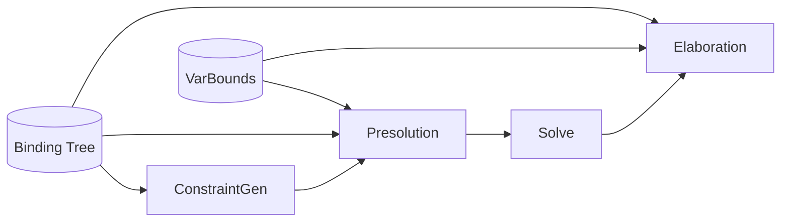

# Design Document

## Overview
This design retires the legacy level tree and makes the binding tree the only
scope model. The key changes are:
- remove `GNodeId`/`GNode` and all `tn*Level` fields
- represent quantifier binders via binding edges (paper Q(n))
- derive binder order using `MLF.Order` (leftmost-lowermost ordering)
- update constraint generation, presolution, normalization/solve, and
  elaboration to use binding edges + `cVarBounds`
- exclude inert binders (unreachable from the quantifier body)
- preserve binder-to-binder bounds when introducing fresh quantifiers

The binding tree already encodes scope and Raise/Weaken semantics, so removing
levels eliminates duplicated state and moves the implementation closer to
`papers/xmlf.txt`.

## Architecture
The migration is staged so each phase can compile and be verified:



Core principles:
- Binding edges are the sole authority for scope and binder membership.
- Quantifier binders are defined by the direct flexible children of a quantifier
  node (`Q(n)` in the paper) that are reachable from its body.
- Binder ordering uses `MLF.Order` over the term-DAG, optionally restricted to
  interiors `I(r)` when needed.

## Components and Interfaces

### 1) Binding-edge binder enumeration
Add helpers to `MLF.Binding`:

```hs
-- Direct flexibly-bound TyVar children of a binder node (Q(n)).
boundFlexChildren :: Constraint -> NodeId -> Either BindingError [NodeId]

-- Quotient-aware variant for union-find contexts.
boundFlexChildrenUnder
  :: (NodeId -> NodeId)
  -> Constraint
  -> NodeId
  -> Either BindingError [NodeId]

-- Ordered binders using leftmost-lowermost keys.
orderedBinders
  :: (NodeId -> NodeId)
  -> Constraint
  -> NodeId  -- ^ binder node (TyForall)
  -> Either BindingError [NodeId]
```

`orderedBinders` should:
- compute order keys using `MLF.Order.orderKeysFromRootWith`
- use the binder body root as the order-key root
- filter to binders reachable from the body root (exclude inert nodes)
- sort the flexibly bound children of the binder node

### 2) Forall specs for quantifier introduction
Introduce a binder-spec type derived from binding edges + bounds:

```hs
data BoundRef
  = BoundNode NodeId   -- bound refers to a non-binder node
  | BoundBinder Int    -- bound refers to the binder at this index

data ForallSpec = ForallSpec
  { fsBinderCount :: Int
  , fsBounds :: [Maybe BoundRef]  -- length == fsBinderCount
  }

forallSpecFromForall
  :: (NodeId -> NodeId)
  -> Constraint
  -> NodeId
  -> Either BindingError ForallSpec
```

`forallSpecFromForall` uses `orderedBinders` to enumerate binders and
`VarStore.lookupVarBound` to collect bounds in the same order. Bounds that
point at another binder are encoded as `BoundBinder index` so `ExpForall` can
remap them to fresh binders.

`Expansion` changes to:

```hs
data Expansion
  = ExpIdentity
  | ExpForall (NonEmpty ForallSpec)
  | ExpInstantiate [NodeId]
  | ExpCompose (NonEmpty Expansion)
```

### 3) Constraint generation with binding roots
Replace the level parameter with a binding-root `NodeId`:

```hs
buildExpr :: Env -> NodeId -> Expr -> ConstraintM (NodeId, AnnExpr)
```

Rules:
- Binding parents represent scope. Allocators keep installing structural binding
  parents (dom/cod/forall body) as a fallback to satisfy binding-tree completeness.
- Each scope tracks the set of nodes created within it.
- `let` introduces a `TyForall` node; after building the RHS, rebind nodes from
  the RHS scope that are reachable from the RHS root to that `TyForall` (flex),
  skipping nodes already bound by nested scopes. Nodes not reachable from the
  RHS root keep their structural binding parents.
- Lambda uses the same scope root (monomorphic).
- For the top-level scope, after the expression root is known, rebind reachable
  top-level nodes to the root node to align with a single outer binder.
- Explicit `forall` in types creates a `TyForall` node and binds its variables
  to that node; bounds are stored in `cVarBounds`.

`AnnExpr` carries the scope root `NodeId` instead of `GNodeId`.

### 4) Presolution updates
Presolution uses binding edges to find binders and create quantifiers:
- `collectBoundVars` and `firstNonVacuousBinders` call `orderedBinders` and
  therefore exclude inert binders.
- `decideMinimalExpansion` compares binder counts instead of level IDs and
  builds `ForallSpec` via `forallSpecFromForall`.
- `applyExpansion` for `ExpForall` allocates fresh binder variables and sets:
  - binding parent of each new binder to the new `TyForall` (flex)
  - bounds from `ForallSpec`, remapping `BoundBinder` to the fresh binders
  - binding parent of the body to the new `TyForall` (flex)

### 5) Normalize and Solve
- Forall equality checks use binder counts (and optionally bounds) rather than
  `tnQuantLevel` equality.
- Remove `ForallLevelMismatch` and level-existence validations.
- Validation relies on `MLF.Binding.checkBindingTree` and the new binder helpers.

### 6) Elaboration
Generalization and reification derive binders from binding edges:
- `generalizeAt` enumerates binders via `orderedBinders` and excludes
  `cEliminatedVars`.
- Bounds are read from `cVarBounds`.
- Rigid vs flexible behavior comes from binding flags along the path, not
  `tnOwnerLevel`.

## Data Models
Changes to `MLF.Types`:
- Remove `GNodeId`, `GNode`, `cGForest`, `cGNodes`.
- Remove `tnVarLevel`, `tnOwnerLevel`, `tnQuantLevel`.
- Update `TyForall` to store only `tnId` and `tnBody`.
- Add `ForallSpec` type and update `Expansion` payload as above.

## Error Handling
- Binding tree errors remain surfaced via `BindingError` and converted to
  phase-specific errors (`PresolutionError`, `ElabError`).
- Forall mismatches become arity/bound mismatches rather than level mismatches.
- Missing bounds default to `Nothing` (bottom) as before.

## Testing Strategy
Prefer property tests for invariants and small regressions for integration:

1) **Binder enumeration property**
   - For randomly generated small binding trees, `boundFlexChildren` returns
     exactly the TyVar nodes whose binding parent is the binder with `BindFlex`.

2) **ForallSpec construction**
   - Regression: a hand-built graph with 2 binders and bounds yields
     `fsBinderCount == 2` and `fsBounds` matches `cVarBounds` order, including
     binder-to-binder remapping.

3) **Presolution expansion regression**
   - `ExpForall` introduces fresh binder vars with expected bounds and binding
     parents.

4) **Pipeline regression**
   - Existing presolution/elaboration tests still pass, with updated expectations
     for binder ordering and elimination.
