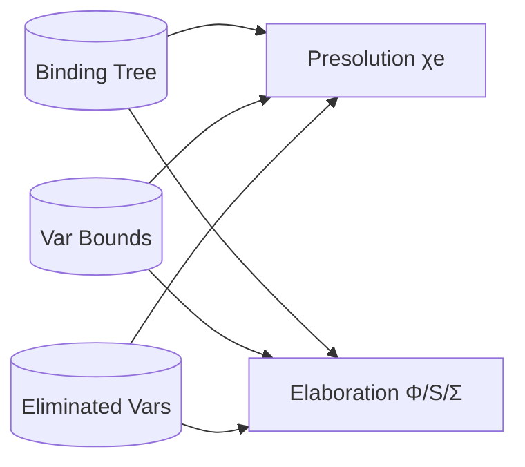

# Design Document

## Overview
We retire the legacy level-based scope model (`cGNodes`, `tnVarLevel`, `RankAdjustment`) by moving all remaining required information into:
- the binding tree (`cBindParents`, `BindFlag`) as the *sole* scope authority,
- a dedicated variable-bound store (so bounds do not live in `GNode.gBinds`),
- a persistent “binder eliminated” marker (so presolution can drop binder-metas without editing `GNode.gBinds`).

This allows removing `MLF.RankAdjustment` and simplifies paper alignment: raising/weakening are binding-edge transformations and do not require updating shadow “levels”.

## Architecture
The migration is staged to keep the pipeline working:

1) **Extract bounds + elimination markers** (still keep levels temporarily)
2) **Cut over presolution instantiation to binding edges** (remove `tnVarLevel`-based decisions)
3) **Cut over elaboration reification/generalization** (remove `cGNodes`/`tnVarLevel` usage)
4) **Remove `RankAdjustment` and legacy data** (cleanup)



## Components and Interfaces

### 1) Variable bounds store
We introduce a bound store independent of `GNode.gBinds`. Two viable encodings:

Option A (preferred, local): store on the node:
```hs
TyVar { tnId :: NodeId, tnVarBound :: Maybe NodeId, ... }
```

Option B (central map): store in the constraint:
```hs
type VarBounds = IntMap (Maybe NodeId)
Constraint { cVarBounds :: VarBounds, ... }
```

Either way, provide a single API surface:
```hs
lookupVarBound :: Constraint -> NodeId -> Maybe NodeId
setVarBound :: NodeId -> Maybe NodeId -> Constraint -> Constraint
```

### 2) Binder elimination marker
Presolution currently “drops” binder-metas by removing them from `GNode.gBinds`.
We replace that with a persistent marker:

```hs
type EliminatedVars = IntSet
Constraint { cEliminatedVars :: EliminatedVars }

isEliminatedVar :: Constraint -> NodeId -> Bool
markEliminatedVar :: NodeId -> Constraint -> Constraint
```

Elaboration must ignore eliminated vars when building quantifier lists.

### 3) Presolution instantiation cut-over
Remove remaining level-based decisions:
- binder-meta placement (replace `binderMetaAt`’s “pick arg tnVarLevel” heuristic with a binding-edge-derived placement rule),
- `collectBoundVars` (stop discovering binders by `tnVarLevel == quantLevel`; instead, identify binders structurally from the ∀ node and its binding interior),
- any residual `GNodeId` ancestor checks used for RaiseMerge heuristics (replace with binding-edge path checks).

Design note: “which binders are instantiated” should come from the structural ∀ node being instantiated, not from a global level registry. The code already has a notion of “binder variables” via instantiation expansion traces; the migration should make that the sole source of binder lists.

### 4) Elaboration reification/generalization cut-over
Replace `GNode.gBinds`-driven quantifier enumeration with:
- binding-tree based “flexible binders under a binder node” enumeration,
- ≺ ordering via `MLF.Order`,
- bounds read from the new bound store,
- exclusion via `cEliminatedVars`.

This does not require changing the xMLF AST. It only changes how we compute:
- the binder list for a `Forall`,
- and the ordering of binders.

## Data Models
Add to `Constraint` (or to `TyVar` if choosing Option A):
- a bound store (`cVarBounds` or `tnVarBound`),
- an eliminated-var set (`cEliminatedVars`).

Remove in final cleanup:
- `Constraint.cGNodes`,
- `TyVar.tnVarLevel`,
- `TyForall.tnOwnerLevel/tnQuantLevel` (or replace with binding-tree equivalents),
- `MLF.RankAdjustment`.

## Error Handling
This migration is primarily structural; prefer compile-time removal over runtime fallbacks:
- missing bounds default to `Nothing`,
- eliminated vars are ignored by elaboration,
- binding-edge queries that previously fell back to levels should instead error if invariants are violated.

## Testing Strategy
Prefer property tests for invariants + regressions for pipeline behavior:

1) **Bounds store regressions**
   - setting/getting bounds survives UF canonicalization and copying.

2) **Elimination regressions**
   - after `dropVarBind`/elimination, reification does not quantify eliminated vars.

3) **Presolution instantiation regressions**
   - scenarios with instance bounds (`b ⩾ a`) still elaborate correctly.

4) **Cut-over audit**
   - `rg` checks: no `cGNodes`/`tnVarLevel` usage in target modules.

